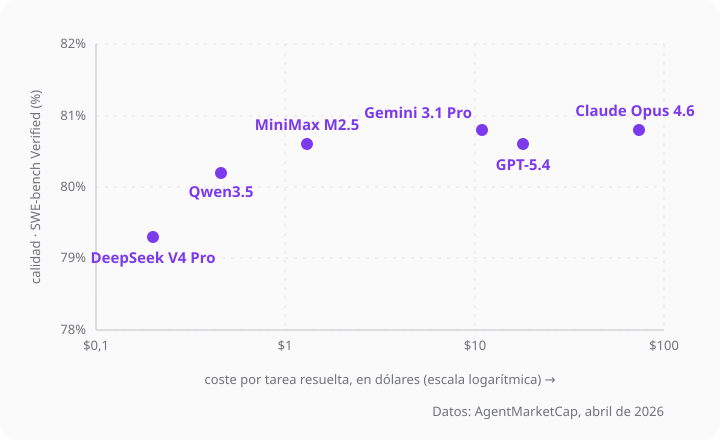

# Elegir un modelo

Un agente es un modelo con herramientas. El **modelo** es el que piensa, y no hay uno mejor para
todo: hay modelos más listos y más caros, y otros rápidos y baratos que para muchas cosas bastan.

## Qué cambia entre modelos

- **Capacidad:** cuántos pasos seguidos acierta sin perderse. Se mide con pruebas (benchmarks),
  como SWE-bench.
- **Rapidez:** lo que tarda en empezar a responder. En un agente, que da muchas vueltas, se nota.
- **Precio:** lo que cuesta cada millón de tokens, de entrada y de salida.
- **Contexto:** cuánto texto le cabe a la vez.
- **Razonamiento:** si "piensa" antes de responder. Acierta más en lo difícil, pero tarda y
  cuesta más.

Piensa en vehículos: una furgoneta pequeña para repartir por el barrio, un camión para una
mudanza. No coges el camión para comprar el pan.

## No siempre el más potente

Pagar más no siempre compra más calidad. En estos seis modelos la calidad es casi la misma (en
torno al 80% en SWE-bench); lo que cambia de verdad es el coste: de veinte céntimos a setenta y
cuatro dólares por tarea.



| Modelo | SWE-bench Verified | Coste por tarea resuelta |
|---|---|---|
| DeepSeek V4 Pro | 79,3 % | $0,20 |
| Qwen3.5 | 80,2 % | $0,46 |
| MiniMax M2.5 | 80,6 % | $1,31 |
| Gemini 3.1 Pro | 80,8 % | $11 |
| GPT-5.4 | 80,6 % | $18 |
| Claude Opus 4.6 | 80,8 % | $74 |

Datos de AgentMarketCap, abril de 2026, sobre 2 millones de tokens por tarea. Cambian a menudo.

## Repartir el trabajo

Lo interesante no es usar siempre el modelo más potente: es darle a cada tarea el que le vale.

| Lo que haces | Con qué |
|---|---|
| Autocompletar, resumir, renombrar, un test sencillo | barato y rápido |
| Una feature normal, leyendo el código | el de en medio |
| Depurar algo difícil, decidir la arquitectura, un refactor grande | el más potente |

Una práctica común: el más listo hace el **plan** y el barato lo **ejecuta**. En el plan se decide
bien o mal; ejecutar es seguir unos pasos, que no necesita tanta cabeza.

> [!TIP]
> Para el usuario promedio no hace falta comerse la cabeza: coge uno bueno y listo. Saberlo vale
> para optimizar, bajando de modelo en lo fácil.

## Cómo se elige en OpenCode

En la terminal, `/models` abre el selector dentro del chat. También se puede fijar al arrancar o
en la configuración:

```bash
opencode models                     # lista los modelos que tienes
opencode --model proveedor/modelo   # arranca con ese
```

En `opencode.json` se deja el de por defecto, y `opencode stats --models` enseña lo que gastas
por modelo.

## El contexto se llena

A un modelo solo le cabe un trozo de conversación. Cuando la charla se hace muy larga, se pierde:
cuesta más y acierta menos. Es como una mesa: con dos papeles los ves, con doscientos no
encuentras nada. Por eso el agente resume lo viejo, y conviene abrir una sesión nueva para otro
tema.

## A dónde va esto

Además de generalistas cada vez más listos, van a crecer los **pequeños y específicos**, buenos en
una sola cosa. Es como un equipo: a cada recado, quien mejor lo hace.

## Para explorar

- [Modelos en OpenCode](https://opencode.ai/docs/models/).
- [models.dev](https://models.dev) — el catálogo de modelos y proveedores.
- [Artificial Analysis](https://artificialanalysis.ai/) — calidad frente a coste.
- [SWE-bench](https://www.swebench.com/) — la prueba de código que enseña la gráfica.

---

**3 de 8** · Anterior: [Tu primer agente](../opencode/) · Siguiente: [Darle contexto](../contexto/)
