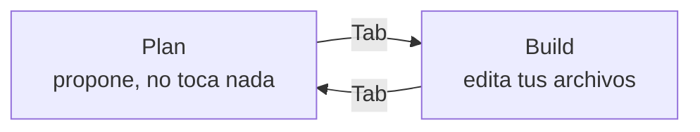

# OpenCode

[OpenCode](https://opencode.ai/) es un agente de IA para la terminal: le pides algo en
lenguaje normal y él lee tu proyecto, propone cambios y los aplica. Es gratis y trae
modelos gratuitos, así que sirve para aprender a trabajar con agentes antes de pagar
nada. Lo que practiques aquí vale igual en Claude Code, Codex o Copilot.

## Cómo encaja todo

Pulsa **Reproducir** o ve paso a paso: se ilumina la pieza que entra en juego en cada
momento. El caso es de este mismo repo (la terminal está simplificada): pedirle un apunte.

```visual
agente-en-accion
```

| Pieza | Dónde va | Cuándo la usa el agente |
|---|---|---|
| `AGENTS.md` | raíz del proyecto | siempre, al arrancar |
| Skill | `.agents/skills/<nombre>/SKILL.md` | solo cuando la tarea encaja con su descripción |
| MCP | `opencode.json` | cuando necesita algo de fuera de tu proyecto |

## Instalar y arrancar

1. Instálalo: `curl -fsSL https://opencode.ai/install | bash` (o
   `npm install -g opencode-ai`).
2. Entra en la carpeta de tu proyecto y ejecuta `opencode`.
3. Escribe `/connect` y elige **OpenCode Zen**, que tiene modelos gratis.
4. Escribe `/init`: analiza el proyecto y te crea un `AGENTS.md`.

## Cómo se trabaja: Plan y Build

Con `Tab` cambias entre dos modos. Pide primero en **Plan**, revisa lo que propone, y
solo entonces pásalo a **Build**.



Ejemplo de sesión (simplificado):

```text
[Plan]  > Cuando se borre un producto, que no desaparezca: márcalo como
          borrado y añade una pantalla de productos borrados.

        Propuesta:
          1. Añadir el campo `borrado` a Producto.java
          2. Cambiar ProductoService.borrar() para que solo lo marque
          3. Nueva vista productos-borrados.html
        ¿Lo aplico?

[Build] > Vale, adelante.

        ✓ Producto.java           (editado)
        ✓ ProductoService.java    (editado)
        ✓ productos-borrados.html (nuevo)
```

Ojo: si no te gusta lo que ha hecho, `/undo` deshace el último cambio.

## `AGENTS.md`: las reglas del proyecto

Es un `.md` normal en la raíz del proyecto. El agente lo lee cada vez que arranca, así
que no tienes que repetirle lo mismo en cada conversación. Ejemplo para una práctica:

```markdown
# Práctica Spring: tienda

- Java 21 + Spring Boot + Thymeleaf + H2.
- Arrancar: `./mvnw spring-boot:run`
- Es una práctica de clase: no me escribas la solución. Explícame y revisa lo que
  hago yo.
```

Si no hay `AGENTS.md` pero sí `CLAUDE.md`, lee ese. Para reglas tuyas en todos los
proyectos está `~/.config/opencode/AGENTS.md`.

## Skills: instrucciones que carga solo si hacen falta

La diferencia con `AGENTS.md`: de cada skill el agente solo ve el nombre y la
descripción. El contenido entero lo carga cuando la tarea encaja (paso 3 del esquema de
arriba).

Una skill es una carpeta con un `SKILL.md`. El frontmatter con `name` y `description` es
obligatorio:

```markdown
---
name: apuntes-claros
description: Estilo de escritura para cualquier .md de este repo. Aplícalo siempre
  que redactes o revises un apunte.
---

# Apuntes claros

- Empieza por lo importante, no por el contexto.
- Código en bloques, nunca descrito en prosa.
```

Este repo ya tiene una en `.agents/skills/apuntes-claros/`, así que si abres OpenCode aquí
la usa sin configurar nada.

## MCP: herramientas de fuera

Un servidor MCP le da al agente acceso a algo que no está en tu proyecto: documentación
actualizada, tu GitHub, una base de datos... Se añade en `opencode.json`, en la raíz del
proyecto. Ejemplo con Context7, que busca en la documentación oficial de librerías:

```json
{
  "$schema": "https://opencode.ai/config.json",
  "mcp": {
    "context7": {
      "type": "remote",
      "url": "https://mcp.context7.com/mcp"
    }
  }
}
```

Luego se lo pides tal cual: "usa context7 y dime cómo se hace un `watch` en Vue 3". Con
`opencode mcp list` ves qué servidores tiene conectados.

## Ponte a prueba

```visual
autoexamen-agentes
```
