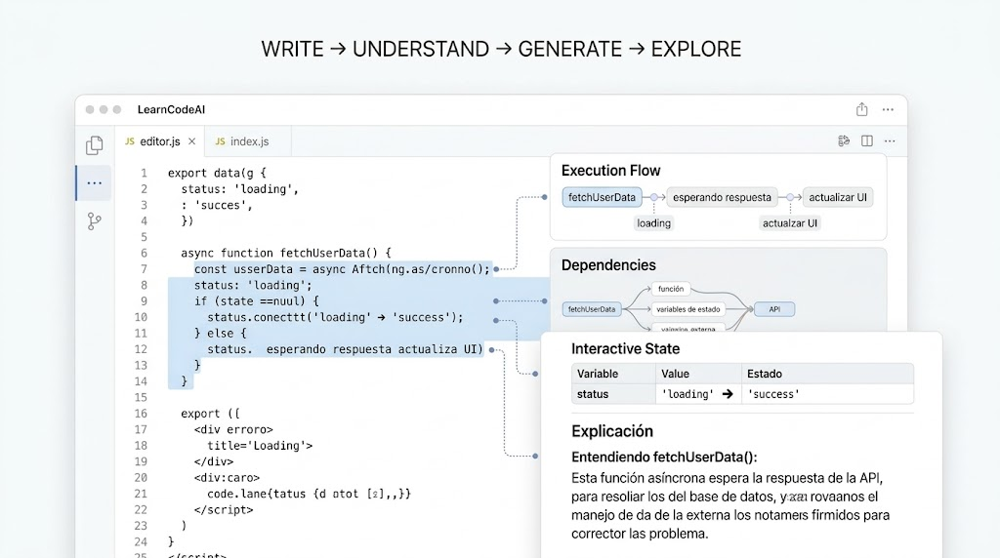

# Entorno interactivo que explica el código

Jupyter deja probar trozos de código pequeños, ejecutarlos paso a paso y ver qué pasa, pero
está atado a Python y a los notebooks. La idea es algo parecido, para cualquier lenguaje,
donde la IA explica el código y además genera la interfaz que mejor lo enseña: al
seleccionar un fragmento, saca un diagrama, un flujo de ejecución, el estado de las
variables, un diff o un ejercicio. Sale de un `AGENTS.md` propio que ya pide explicar el
código, justificar decisiones y señalar mejoras, y que casi siempre acaba en párrafos de
texto.

*A escala de PFC:* un notebook para escribir y ejecutar fragmentos, conectado a una IA que
consulta documentación actual con [Context7](https://context7.com) y devuelve el visual
adecuado para cada caso. La arquitectura debería aguantar el salto a un entorno tipo IDE
que entienda el proyecto entero, vea las dependencias y diga qué partes se ven afectadas
por un cambio.
