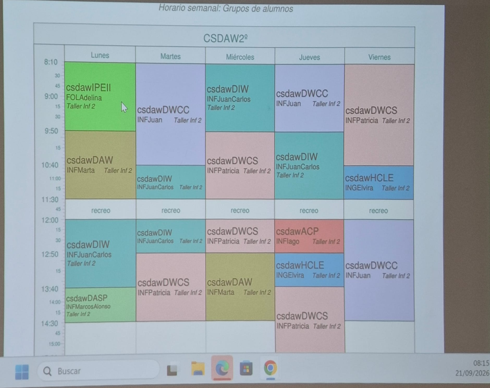

# Horario — CSDAW 2º

Taller Inf 2 salvo que se indique lo contrario. Recreo 11:30–12:00.

Fin de las clases: 14:30 de lunes a miércoles y los viernes, 15:20 los jueves. Cada clase
dura 50 min; los bloques de la tabla que no llevan "/" son dos clases seguidas de la misma
asignatura.

| Hora | Lunes | Martes | Miércoles | Jueves | Viernes |
|---|---|---|---|---|---|
| 8:10 | IPEII (FOL Adelina) | DWCC (INF Juan) | DIW (INF JuanCarlos) | DWCC (INF Juan) | DWCS (INF Patricia) |
| 9:50 | DAW (INF Marta) | DWCC (INF Juan) / DIW (INF JuanCarlos) | DWCS (INF Patricia) | DIW (INF JuanCarlos) | DWCS (INF Patricia) / HCLE (ING Elvira) |
| 12:00 | DIW (INF JuanCarlos) | DIW (INF JuanCarlos) / DWCS (INF Patricia) | DWCS (INF Patricia) / DAW (INF Marta) | ACP (INF Iago) / HCLE (ING Elvira) | DWCC (INF Juan) |
| 13:40 | DASP (INF MarcosAlonso) | DWCS (INF Patricia) | DAW (INF Marta) | DWCS (INF Patricia) | DWCC (INF Juan) |

Última actualización: 2026-09-22.
